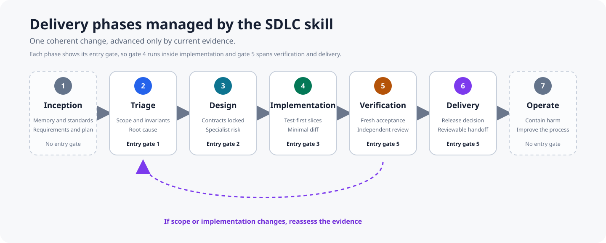
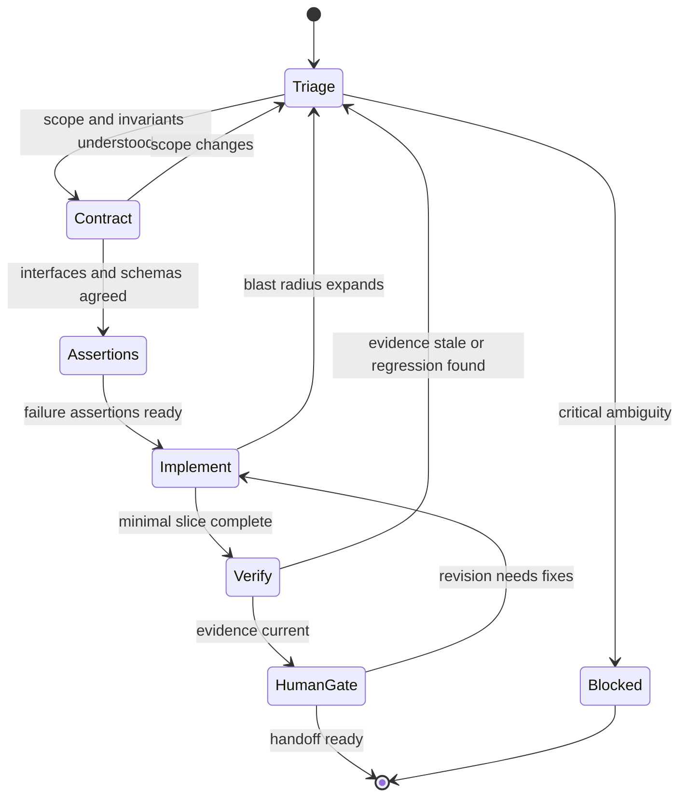

# SDLC

[`sdlc`](skills/sdlc) is one portable [Agent Skill](https://agentskills.io)
for AI-assisted software delivery. It guides an agent from a request to one
reviewable change using current, inspectable evidence across seven delivery
phases: inception, triage, design, implementation, verification, delivery,
and operate.

It is not a collection of separately installed skills. The repository ships
one discoverable skill named `sdlc`; its internal modules are loaded only when
their task triggers apply.

[](docs/SDLC-DEVELOPMENT-FLOW.md)

## Choose your path

| Goal | Start here |
|------|------------|
| Use SDLC in a project | [Use SDLC](#use-sdlc) |
| Configure modules or organization behavior | [Configure or extend SDLC](#configure-or-extend-sdlc) |
| Contribute to the skill or prepare a release | [Maintain and release SDLC](#maintain-and-release-sdlc) |

## Start here

Install `sdlc` in the project where your agent works:

```bash
npx skills add amdluigi/sdlc --skill sdlc
```

Then make a normal request, for example:

> Use SDLC to add a validated settings endpoint.

The agent evaluates the request and the repository before loading the
applicable internal guidance. You do not invoke lifecycle modules yourself.
For the first non-trivial task, review and commit the project resources
described in [Project setup](#project-setup).

## What SDLC does

SDLC helps agents avoid treating a successful happy path as proof that a
change is ready. It:

- defines one coherent outcome and identifies the affected boundaries;
- reuses current evidence from people, CI, other agents, or other workflows;
- establishes contracts before implementation when contracts are at risk;
- applies test-first implementation to changed behavior;
- evaluates specialist concerns such as accessibility, compatibility, data,
  security, observability, performance, and dependencies only when relevant;
- verifies the final revision and prepares a human-readable handoff.

The amount of process scales with risk. A small behavior-preserving change
stays light. A public API change, migration, authentication change, or
user-facing feature receives stronger planning, verification, and review.



Human decisions remain authoritative. SDLC asks for clarification or approval
when an ambiguity, product decision, or risk cannot be resolved from
inspectable repository evidence.

For the complete visual explanation, see the
[SDLC development flow](docs/SDLC-DEVELOPMENT-FLOW.md).

## Delivery phases

Every module belongs to a category, and every category belongs to one of
seven delivery phases. The grouping is declared in the
[module registry](skills/sdlc/modules/registry.json) and is machine readable.

| Phase | Purpose |
|-------|---------|
| `inception` | Establish memory, standards, requirements, and a plan |
| `triage` | Fix scope, invariants, and root cause before building |
| `design` | Lock contracts and qualify specialist risk |
| `implementation` | Build thin, test-first, verified slices |
| `verification` | Prove acceptance, readiness, and independent review |
| `delivery` | Decide the release and hand off a reviewable change |
| `operate` | Contain production harm and convert gaps into improvements |

A phase gate is the entry gate, meaning the earliest evidence gate at which
the phase participates. `inception` and `operate` declare no gate, because
they sit outside the per-change state machine and therefore carry no
blocking authority over a single change.

Phase is a grouping and presentation layer. Module resolution happens per
capability, so a phase never binds a provider on its own.

[docs/DELIVERY-PROFILE.md](docs/DELIVERY-PROFILE.md) is generated from the
registry and shows which provider currently serves each capability.
Regenerate it after changing configuration:

```bash
python skills/sdlc/scripts/delivery_profile.py render \
  --registry skills/sdlc/modules/registry.json \
  --output docs/DELIVERY-PROFILE.md
```

## What SDLC provides

`sdlc` is a compact orchestrator backed by internal modules. Each one belongs
to a delivery phase, so you can see which part of the lifecycle it serves:

| Phase | Module | Responsibility |
|-------|--------|----------------|
| `inception` | `project-memory` | Preserve architecture, decisions, rules, active context, and terminology |
| `inception` | `project-standards` | Apply repository-specific stack and delivery policy |
| `inception` | `prd` | Require an approved, traceable product requirements document for new capabilities |
| `inception` | `planning` | Plan the minimum complete change |
| `triage` | `change-contract` | Define one coherent outcome, acceptance criteria, non-goals, impact, and PR boundary |
| `triage` | `debugging` | Reproduce, localize, and fix root causes |
| `design` | `api-compatibility` | Classify consumer-visible contract changes and prove transition behavior |
| `design` | `data-migration` | Prove safe migration sequencing, integrity, resumability, and recovery |
| `design` | `security-auth` | Check security, authentication, and authorization risks |
| `design` | `performance-concurrency` | Establish performance, contention, resource, and load-correctness evidence |
| `design` | `accessibility-browser` | Qualify changed rendered flows, interaction states, and accessibility behavior |
| `design` | `dependency-supply-chain` | Assess third-party necessity, provenance, reproducibility, advisories, and licenses |
| `design` | `observability` | Design and validate bounded, privacy-aware logs, metrics, traces, and alerts |
| `implementation` | `tdd` | Enforce red, minimal green, and refactor for changed behavior |
| `implementation` | `implementation` | Deliver thin, verified, safe, reversible slices |
| `verification` | `testing` | Own final acceptance coverage and verification |
| `verification` | `review` | Run risk-scaled independent review perspectives |
| `verification` | `operational-readiness` | Plan reversibility, rollout, observability, and post-change validation |
| `delivery` | `pr-handoff` | Inspect the final diff and prepare a human-readable readiness decision |
| `delivery` | `release-launch` | Make an evidence-backed release decision and verify post-release state |
| `operate` | `incident-response` | Contain production harm, preserve evidence, verify recovery, and track corrective actions |
| `operate` | `continuous-improvement` | Turn recurring process gaps into inactive, reviewable extension candidates |

`.sdlc/config.json` lists these modules in this same order, so the file reads
top to bottom as the lifecycle.

Modules are internal Markdown references, not separately discoverable skills.
The orchestrator uses the
[module registry](skills/sdlc/modules/registry.json) to evaluate triggers,
evidence contracts, and existing evidence before loading only the unresolved
guidance. The domain modules remain trigger-lazy, so a backend-only change
does not automatically load browser guidance and an unchanged locked
dependency does not automatically trigger supply-chain work.

## Use SDLC

Follow [Start here](#start-here) to install the skill, then give the agent a
normal feature, fix, refactor, or review request. See
[Install SDLC](#install-sdlc) for host-specific installation options.

### Examples

Ask for the engineering outcome. SDLC selects the relevant internal modules
and evidence gates for the task:

```text
Use SDLC to add a validated settings endpoint. Preserve existing API
compatibility and include focused tests.
```

```text
Use SDLC to diagnose why duplicate webhook deliveries create two invoices.
Reproduce the issue, identify the root cause, add a regression test, and
implement the smallest safe fix.
```

```text
Use SDLC to add pagination to the orders API. Identify current consumers,
define the transition contract, and verify backward compatibility.
```

```text
Use SDLC to review this branch for security, correctness, test coverage, and
operational risks. Do not change code unless I approve a fix.
```

```text
Use SDLC to prepare version 1.2.0 for release. Verify the release criteria,
rollback posture, rollout signals, and post-release checks before declaring it
ready.
```

SDLC uses project configuration and task evidence to right-size the work. It
does not run every module merely because the request mentions SDLC.

## Example: payment retries

A retry around a payment call can look correct while charging a customer
twice after a timeout. With SDLC, the agent first inspects the caller,
provider adapter, persistence model, webhook path, retry policy, and existing
idempotency behavior.

Before implementation, it makes the critical boundaries explicit: the
idempotency-key format and scope, payload matching, provider correlation,
replay response, persistence boundary, retry window, timeout ambiguity, and
error schema. Tests then cover replaying the same request, rejecting a
different payload under the same key, reconciling a provider timeout without
a second charge, and concurrent persistence conflicts. Only then does the
agent make the smallest complete implementation change and verify the
resulting data path and operational signals.

## Project setup

On the first non-trivial task, SDLC creates
`.sdlc/config.json` from the bundled
[configuration template](skills/sdlc/assets/sdlc-config.template.json) when
it is missing. With the default configuration:

- all core modules are enabled but are loaded only when their triggers apply;
- project memory is created under `.sdlc/memory/` when needed;
- project standards can propose a `PROJECT-STANDARDS.md` file;
- private local aggregate measurement is disabled.

Review and commit the project-owned files so teammates and agents share the
same delivery policy and durable context. Do not place secrets, credentials,
customer data, or raw sensitive material in project memory or configuration.

## Configure or extend SDLC

Use the bundled [configuration template](skills/sdlc/assets/sdlc-config.template.json)
to make an explicit project policy decision about module activation.

Configuration controls which safeguards are active. A request to skip a
module does not override the committed configuration. Disabling a module is
an explicit project policy decision and is disclosed in SDLC's final report.

The skill supports approved replacement instruction providers for individual
core modules and project-local extensions for organization-specific behavior.
Extensions augment the core skill; they cannot disable enabled safeguards,
execute arbitrary scripts, or activate without explicit review and a
committed configuration change.

For the module model, triggers, evidence contracts, provider boundary, and
extension lifecycle, see [Architecture](docs/ARCHITECTURE.md). The
[module registry](skills/sdlc/modules/registry.json) is the authoritative
list of internal modules and their responsibilities.

### Module policy

`.sdlc/config.json` is the file you edit, and it is shaped by the lifecycle.
Every module sits under the delivery phase that invokes it, so the phase
names are in the file itself:

```json
{
  "schemaVersion": 4,
  "phases": {
    "inception": {
      "project-memory": true,
      "project-standards": true,
      "prd": true,
      "planning": true
    },
    "triage": {
      "change-contract": true,
      "debugging": true
    },
    "design": {
      "api-compatibility": true,
      "data-migration": true,
      "security-auth": true,
      "performance-concurrency": true,
      "accessibility-browser": true,
      "dependency-supply-chain": true,
      "observability": true
    },
    "implementation": {
      "tdd": true,
      "implementation": true
    },
    "verification": {
      "testing": true,
      "review": true,
      "operational-readiness": true
    },
    "delivery": {
      "pr-handoff": true,
      "release-launch": true
    },
    "operate": {
      "incident-response": true,
      "continuous-improvement": true
    }
  },
  "extensions": {
    "project": {},
    "global": {}
  },
  "measurement": {
    "enabled": false
  }
}
```

These are the same seven phases as the
[delivery phases table](#what-sdlc-provides) and the lifecycle diagram, in
the same order. To change how a phase is served, find the phase and edit the
module under it.

Which phase a module belongs to is owned by the
[module registry](skills/sdlc/modules/registry.json), not by this file.
Moving a module to another phase is rejected:

```text
phases.operate.testing belongs to delivery phase verification; module
placement is owned by the registry and may not be changed by configuration
```

Without that rule a module could be moved to a phase that is checked later
or not gated at all, which would let configuration weaken a safeguard
instead of turning it off in the open.

Each module takes one of four values:

| Value | Meaning |
|-------|---------|
| `true` | Use the bundled implementation. You have not decided, so SDLC may raise a competing installed skill with you |
| `false` | Disable the module. Disclosed in SDLC's final report |
| `{"provider": "bundled"}` | Keep the bundled implementation, decided. SDLC stops asking |
| `{"replaceWith": "<skill-id>"}` | An external skill serves this module |

`true` and `{"provider": "bundled"}` run identical instructions. They differ
only in whether you have made a decision.

A module is an interface, and the skill that serves it is an implementation.
Each bundled implementation is named after the interface it serves, so
`sdlc-testing` serves `testing`. To see which implementation every interface
is currently bound to, read
[the delivery profile](docs/DELIVERY-PROFILE.md). The `sdlc-` prefix is
reserved, so no external skill can claim a bundled name.

`change-contract`, `review`, `operational-readiness`, and `pr-handoff` accept
only `true` or `false`. Each renders the judgment that permits a change to
advance, so delegating one would let a provider authorize its own
progression.

If you already have a configuration written before this shape existed,
SDLC upgrades it in place the next time it reads it. Schema versions 1
through 3 are still accepted, your decisions are preserved, and the file is
rewritten under `phases`. There is nothing to run.

### Replace a bundled module with an external skill

SDLC works standalone and depends on no external skill. Installing other
workflow skills changes nothing on its own: they are not candidates to serve
a module unless they declare themselves, so no configuration, prompting, or
conflict arises from their presence.

Replacing a module takes three steps.

**Step 1. The skill declares what it serves.** Its author ships
`sdlc-capability.json` beside its skill document. A bundled implementation has
exactly this shape, so the shortest route is to copy one:

```bash
cp -r skills/sdlc/modules/sdlc-testing ./acme-testing
```

You now have a working skill: a `SKILL.md` with Agent Skill frontmatter and a
declaration beside it. Change `name` in the frontmatter, then change `id` to
match, set `mode` to `replace`, and add `evaluations`:

```json
{
  "schemaVersion": 1,
  "id": "acme-testing",
  "capability": "testing",
  "mode": "replace",
  "instructions": "SKILL.md",
  "trigger": "When behavior changes.",
  "exitSignal": "The acme suite passes.",
  "evidence": ["The acme suite reported a result for the change."],
  "evaluations": "evals.json",
  "compatibleSdlc": ">=1.0.0 <2.0.0"
}
```

`capability` must name a module from the table above. `id` is your skill's own
identity and may not begin with `sdlc-`, which is reserved for the
implementations the bundle ships. The declaration cannot name a phase: the
registry decides where a module is gated, so a provider cannot move itself
somewhere the lifecycle checks less.

**Step 2. Ask SDLC what it can see.** This command reads only; it changes
nothing and never adopts a skill:

```bash
python skills/sdlc/scripts/resolve_providers.py survey \
  --project-root . \
  --registry skills/sdlc/modules/registry.json \
  --sdlc-version 1.0.0 \
  --provider-root ~/.agent-skills
```

SDLC prints a `capabilities` list with one entry per module. The entry for
the example above:

```json
{
  "active": {
    "type": "bundled"
  },
  "alternatives": [
    {
      "eligible": true,
      "id": "acme-testing",
      "mode": "replace"
    }
  ],
  "capability": "testing",
  "category": "verification",
  "decision": "developer-choice-required",
  "deliveryPhase": "verification",
  "entryGate": 5,
  "explicit": false,
  "replaceable": true,
  "state": "enabled"
}
```

Read it as: the `testing` module runs in the `verification` phase, the
bundled module is serving it, `acme-testing` could serve it instead, and you
have not decided. `deliveryPhase` and `entryGate` come from the
[module registry](skills/sdlc/modules/registry.json), never from the skill.
The full shape of an entry is
[contracts/provider-survey.schema.json](skills/sdlc/contracts/provider-survey.schema.json).

**Step 3. Record your decision** by editing that module under its phase in
`.sdlc/config.json`. `testing` runs in `verification`, which the survey just
told you:

```json
    "verification": {
      "testing": { "replaceWith": "acme-testing" },
      "review": true,
      "operational-readiness": true
    },
```

Or keep the bundled module and stop being asked:

```json
      "testing": { "provider": "bundled" },
```

Re-run the survey to confirm; `decision` becomes `settled`. Until you record
one, SDLC keeps using its own module and raises the choice rather than
switching by itself.

A replacement changes only the instructions for that module. The SDLC
registry still owns its trigger, evidence contract, freshness, and readiness
decision. Providers resolve by exact declared identity and bind to an
immutable instruction snapshot; ambiguous, unavailable, or incompatible
providers block rather than silently falling back to different instructions.

Work produced by any other skill is assessed on its merits regardless of
whether it was selected as a provider. An artifact satisfies a module when it
meets that module's evidence contract and does not contradict evidence
already accepted for another enabled module. Producing an artifact never
grants authority over whether a change may advance.

## Advanced usage

### New capabilities and PRDs

New projects, new user-facing or product-facing features, and Significant
internal capabilities require an explicitly approved PRD before planning or
implementation. Bug fixes, refactors, maintenance, and small internal tools
use the lighter change-contract path unless they introduce a new capability.

When the project has no established convention, create a PRD at:

```text
docs/prds/FEATURE_ID.md
```

A PRD identifies its stable feature ID, approved status, and version. It
defines the problem, intended users and benefit, goals and non-goals,
requirements, acceptance criteria, constraints, decisions, and approval
evidence. Validate its structure with:

```powershell
python .agents\skills\sdlc\scripts\validate_artifacts.py validate-prd docs\prds\FEATURE_ID.md
```

SDLC can also use an existing local specification without creating a competing
PRD. Inspect it first, then explicitly reconcile it to one authoritative
source:

```powershell
python .agents\skills\sdlc\scripts\reconcile_artifacts.py inspect --project-root . --source docs\specifications\FEATURE_ID.md --kind generic-spec
python .agents\skills\sdlc\scripts\reconcile_artifacts.py reconcile --project-root . --source docs\specifications\FEATURE_ID.md --kind generic-spec --report .sdlc\reconciliation\FEATURE_ID.json
python .agents\skills\sdlc\scripts\reconcile_artifacts.py validate --project-root . --report .sdlc\reconciliation\FEATURE_ID.json --require-approved
```

Reconciliation is local and does not infer requirements or approval. Source
drift, conflicts, unmapped fields, and stale approval block planning until
they are resolved.

### Test-first plans and execution continuity

For new behavior and bug fixes, SDLC requires an observed failing test, the
minimum implementation that makes it pass, and refactoring only while green.
Tests exercise real behavior; mocks are limited to genuine external seams.

For Standard and Significant work, plans describe the affected scope,
sequencing, verification, risks, and deferred work. Plans tied to a PRD map
their tasks and acceptance evidence to its requirements. Validate a plan
before implementation:

```powershell
python .agents\skills\sdlc\scripts\validate_artifacts.py validate-plan docs\plans\FEATURE_ID.md --project-root .
```

Long-running work can use a small, untracked execution cursor:

```powershell
python .agents\skills\sdlc\scripts\validate_artifacts.py cursor docs\plans\FEATURE_ID.md --project-root . --task TASK_ID --complete PREVIOUS_TASK_ID
python .agents\skills\sdlc\scripts\validate_artifacts.py cursor-status docs\plans\FEATURE_ID.md --project-root .
```

### Adaptive extensions

SDLC can propose an extension when a reusable process gap recurs across
tasks. It does not learn code fixes, arbitrary commands, or every developer
correction. Draft extensions remain inactive until a developer reviews both
the extension and the configuration change that enables it.

Project-owned extension data stays separate from the installed skill:

```text
.sdlc/
├── learning/
│   └── candidates.json
└── extensions/
    └── <extension-id>/
        ├── extension.json
        ├── MODULE.md
        └── evals.json
```

Use the installed helper to inspect candidates, validate a draft, record a
rejection, or activate an approved extension:

```powershell
$manage = ".agents\skills\sdlc\scripts\manage_extensions.py"
$extension = "verify-generated-output"

python $manage list-candidates --project-root .
python $manage validate-extension --project-root . --extension $extension
python $manage reject --project-root . --candidate $extension --reason "Covered by existing project policy"
python $manage activate --project-root . --extension $extension
python $manage resolve --project-root .
```

Extensions cannot disable enabled safeguards, execute scripts, or mutate the
installed core skill. They must exclude secrets, personal data, proprietary
code, raw prompts, and unnecessary project identifiers.

### Privacy

SDLC does not enable telemetry by default. Optional measurement stores only
closed aggregate counters locally after an explicit, committed configuration
change. It does not collect prompts, code, credentials, paths, repository
names, task identifiers, model identifiers, timestamps, or exact durations.

To manage local measurement explicitly:

```powershell
$metrics = ".agents\skills\sdlc\scripts\manage_metrics.py"

python $metrics status --project-root .
python $metrics configure --project-root . --enabled true
python $metrics inspect --project-root . --json
python $metrics reset --project-root .
python $metrics configure --project-root . --enabled false
python $metrics delete --project-root .
```

Commit the configuration change after enabling or disabling measurement.
Disabling stops new writes but retains existing local aggregates for
inspection, reset, or deletion. To stop and erase measurement, disable it
first and then delete the store.

### Artifact commands

The bundled helper validates SDLC artifacts and renders local handoff text.
These commands operate on local files only; they do not contact a forge,
inspect remotes, publish, or merge work.

```powershell
# Explain or render an already-created operator state.
python .agents\skills\sdlc\scripts\validate_artifacts.py explain --input .sdlc\operator-state.json --detail normal
python .agents\skills\sdlc\scripts\validate_artifacts.py preview --input .sdlc\operator-state.json --detail concise
python .agents\skills\sdlc\scripts\validate_artifacts.py render-coverage --input .sdlc\operator-state.json --detail detailed

# Validate approved planning and handoff artifacts.
python .agents\skills\sdlc\scripts\validate_artifacts.py validate-prd docs\prds\FEATURE_ID.md
python .agents\skills\sdlc\scripts\validate_artifacts.py validate-plan docs\plans\FEATURE_ID.md --project-root .
python .agents\skills\sdlc\scripts\validate_artifacts.py validate-handoff .sdlc\handoff.json --project-root .

# Render a validated handoff for a forge without publishing it.
python .agents\skills\sdlc\scripts\validate_artifacts.py render-handoff .sdlc\handoff.json --forge github
```

## Install SDLC

### Skills CLI

```bash
# Install into the current project.
npx skills add amdluigi/sdlc --skill sdlc

# Install globally for selected agents.
npx skills add amdluigi/sdlc -g -a claude-code -a codex

# Inspect the repository without installing.
npx skills add amdluigi/sdlc --list

# Update an existing installation.
npx skills update amdluigi/sdlc
```

To generate a one-off prompt or launch an agent:

```bash
npx skills use amdluigi/sdlc --skill sdlc --agent claude-code
```

### Claude Code plugin

```text
/plugin marketplace add amdluigi/sdlc
/plugin install amdluigi-sdlc@amdluigi
```

The plugin ships the same single `sdlc` skill.

### Manual installation

Copy the complete [`skills/sdlc`](skills/sdlc) directory, not only
`SKILL.md`. The skill needs its registry, contracts, modules, scripts, and
templates beside the entry point.

Common project-local locations are:

| Host | Location |
|------|----------|
| Claude Code | `.claude/skills/sdlc/` |
| VS Code Copilot / Copilot CLI | `.github/skills/sdlc/` |
| Cursor Agent | `.cursor/skills/sdlc/` or the configured skill directory |
| Agent Skills-compatible host | `.agents/skills/sdlc/` |

### Support levels

| Host or profile | Support level | Installation path |
|---|---|---|
| VS Code Copilot | Qualified | Repository installer profile `copilot-vscode` |
| Claude Code | Qualified | Plugin, Skills CLI, or installer profile `claude-code` |
| Agent Skills-compatible host | Qualified | Generic installer profile |
| Codex | Experimental | Skills CLI or manual copy |
| Other hosts | Compatible by convention | Skills CLI or manual copy when the host supports Agent Skills |

“Qualified” describes repository-owned installation evidence, not every agent
that can read Markdown. See the
[host qualification policy](qualification/HOST-QUALIFICATION.md) for the
meaning of each support level.

### Repository installers

Use the repository installers when developing or when you need an explicit
copy or link installation:

```powershell
.\scripts\install.ps1 -Profile copilot-vscode -Scope project -Mode copy -TargetProject C:\dev\my-app
```

```bash
./scripts/install.sh ~/dev/my-app --profile claude-code --scope project --mode link
```

Use `-DryRun -Json` or `--dry-run --json` to inspect installer resolution
without changing files.

## Maintain and release SDLC

Read [Contributing](CONTRIBUTING.md) before changing the skill. It describes
the public pull request flow, validation expectations, and release
preparation without requiring private maintainer material.

## Public code authority

The `sdlc` repository is the public code authority for its product code,
tests, documentation, CI, releases, and contributions. Public changes are
reviewed and merged through ordinary pull requests.

## Documentation

The public repository contains the material needed to install, use, evaluate,
and contribute to SDLC:

- [SDLC development flow](docs/SDLC-DEVELOPMENT-FLOW.md): visual lifecycle,
  evidence gate, and risk scaling.
- [Architecture](docs/ARCHITECTURE.md): orchestrator, configuration, modules,
  evidence, extensions, and helper boundaries.
- [Repository charter](docs/REPOSITORY-CHARTER.md): mission, product
  boundaries, and stability promises.
- [Canonical language](CONTEXT.md): repository-specific terms.
- [Contributing](CONTRIBUTING.md): how to propose a focused public change.

Repository development artifacts and maintainer context are not required to
install or use the skill.

## License

MIT, see [LICENSE](LICENSE).
