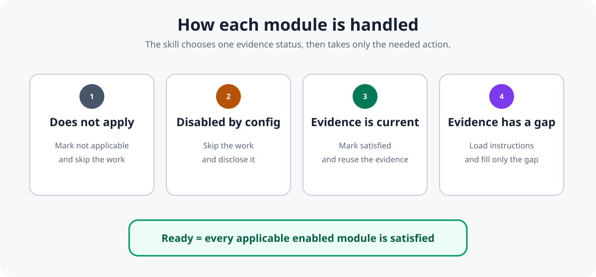
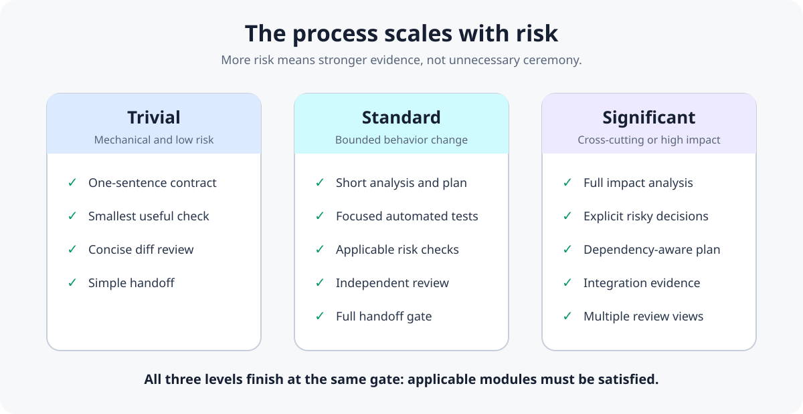

# SDLC development flow

These diagrams explain the development process managed by the SDLC skill.
They separate the lifecycle, evidence gate, and risk scaling so each image
answers one question.

## 1. What is the overall development process?

The SDLC skill guides one coherent change through 7 delivery phases:
inception, triage, design, implementation, verification, delivery, and
operate. It can return to an earlier phase when scope, implementation, or
evidence changes.

The phases group capabilities for explanation and review. They are not the
evidence gate itself. `inception` and `operate` declare no entry gate, because
they sit outside the per-change state machine.

The number on each phase is its entry gate: the earliest of the five
lifecycle gates in [SKILL.md](../skills/sdlc/SKILL.md) at which any of its
categories participates. It is not a per-phase identifier, so the numbers do
not run one per phase. Gate 4, minimal-diff implementation, participates only
in the implementation phase, which already enters at gate 3 for contract
testing, so gate 4 never appears as an entry gate. Gate 5, verification and
the PR gate, is the entry gate for both verification and delivery, because
the handoff contract is assessed under it.

## 2. Why does the skill sometimes run different checks?

The skill evaluates modules lazily. It skips modules that do not apply,
discloses modules disabled by project configuration, reuses current evidence,
and performs only unresolved work.

## 3. How much process does a change receive?

The process is proportional to risk. A typo does not receive the same ceremony
as an authentication or data migration change, but both must provide enough
evidence for the risks they introduce.

## Source and maintenance

The module order and the delivery phase a module belongs to are defined by
[`skills/sdlc/modules/registry.json`](../skills/sdlc/modules/registry.json).
Each module's trigger and evidence contract live in the
`sdlc-capability.json` beside that module. These diagrams are explanatory
views, not an authoritative replacement for those files.

Keep each diagram:

- focused on one question;
- readable without zoom at typical documentation width;
- understandable without relying on color alone;
- accessible through an SVG title, description, and descriptive Markdown alt
  text;
- aligned with the current module registry.
